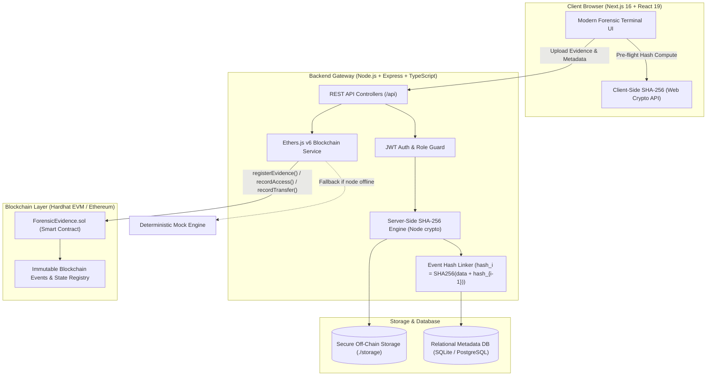
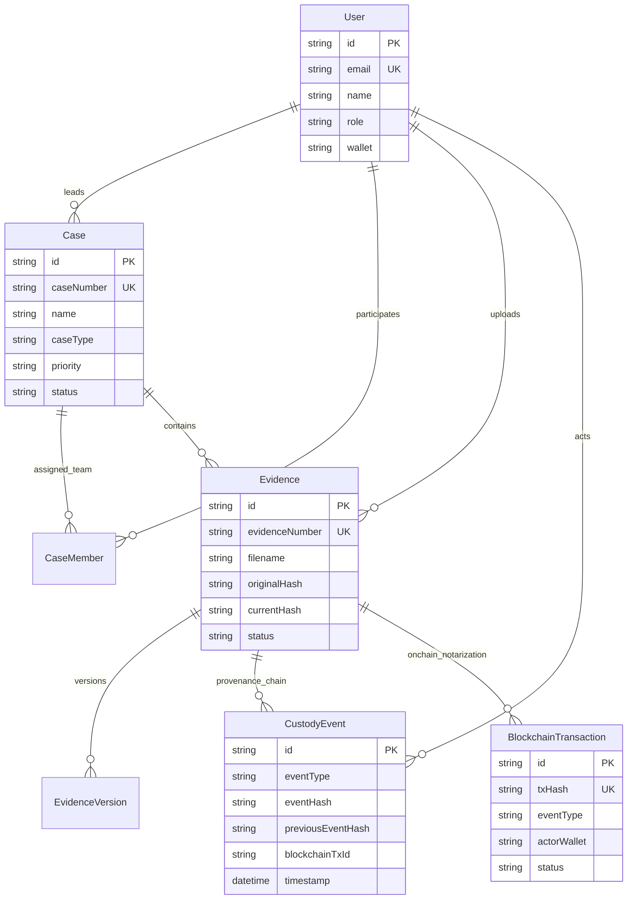

# ForensiChain 🛡️⛓️

> **Tamper-Evident Blockchain-Based Digital Evidence Provenance & Chain-of-Custody System**

[](https://soliditylang.org/)
[](https://hardhat.org/)
[](https://nextjs.org/)
[](https://react.dev/)
[](https://www.typescriptlang.org/)
[](https://www.prisma.io/)
[](https://tailwindcss.com/)
[](LICENSE)

---

## 📑 Table of Contents

- [Executive Summary](#-executive-summary)
- [System Architecture](#-system-architecture)
- [Key Features](#-key-features)
- [Cryptographic & Security Design](#-cryptographic--security-design)
- [Technology Stack](#-technology-stack)
- [Repository Structure](#-repository-structure)
- [Prerequisites & Quick Setup](#-prerequisites--quick-setup)
- [Smart Contract Specification](#-smart-contract-specification)
- [API Reference](#-api-reference)
- [Database Schema](#-database-schema)
- [Demo & Review Guide](#-demo--review-guide) _(Evaluator Walkthrough)_

---

## 🔍 Executive Summary

In cyber incident response, criminal law, and regulatory compliance, digital evidence (disk images, memory dumps, network PCAP captures, server event logs, and email archives) is fragile and susceptible to:

1. **Accidental Modification:** Metadata alteration or bit-rot during analysis.
2. **Intentional Tampering:** Insider tampering or adversary manipulation before courtroom presentation.
3. **Chain-of-Custody Disputes:** Lack of an auditable, verifiable record proving _who_ handled _what_ evidence, _when_, _why_, and with _which tools_.

**ForensiChain** provides an immutable, court-admissible chain-of-custody engine. By coupling **off-chain high-capacity storage** with **on-chain Ethereum/EVM cryptographic notarization**, ForensiChain guarantees mathematical tamper-evidence without disclosing sensitive case files or personally identifiable information (PII) on a public or consortium ledger.

---

## 🏗️ System Architecture



### Architectural Highlights

- **Zero Raw Data On-Chain:** Raw evidentiary artifacts remain strictly in dedicated off-chain storage; only cryptographically irreversible 256-bit digest fingerprints are published to the smart contract.
- **Bi-Directional Verification:** Hashes are verified client-side via the W3C Web Crypto API and corroborated server-side using streaming SHA-256 to mitigate client tampering.
- **Dual-Mode Blockchain Service:** Connects to an active Hardhat EVM node on `http://127.0.0.1:8545`. If no node is active, the backend seamlessly switches to a cryptographic fallback mode, ensuring zero evaluation downtime.

---

## ⚡ Key Features

### 1. Forensic Case Management

- Hierarchical case structure with unique identifiers (`CASE-YYYY-NNNN`).
- Priority labeling (`LOW`, `MEDIUM`, `HIGH`, `CRITICAL`) and case typology (`IP_THEFT`, `MALWARE`, `FRAUD`, `UNAUTHORIZED_ACCESS`, `PHISHING`, `DATA_LEAK`, `SCADA`, `MOBILE_FORENSICS`).
- Investigator assignment and role-based multi-investigator case collaboration.

### 2. Evidence Ingestion & Cryptographic Notarization

- Automated evidence tracking codes (`EVD-NNNNNN`).
- High-performance file streaming supporting up to 100 MB uploads (configurable).
- Automated generation of the genesis chain-of-custody block and smart contract registration.

### 3. Comprehensive Chain-of-Custody Actions

- **Record Access:** Explicitly logs forensic record inspection with actor attribution and timestamps.
- **Record Analysis:** Logs forensic investigations, identifying forensic utilities (e.g., Autopsy, Volatility, Wireshark, FTK Imager), analysis findings, and severity rating.
- **Transfer Custody:** Formal handoff mechanism transferring custody from one investigator to another with required justification notes.
- **Integrity Verification:** Instant byte-level re-hashing comparing current binary status against the genesis registration hash.

### 4. Standalone Integrity Hub (Tamper Detection)

- Interactive dropzone allowing investigators or court auditors to drag and drop any file to immediately verify whether its hash matches the on-chain recorded fingerprint.
- Visual alerts distinguishing intact evidence from tampered/corrupted evidence.

### 5. Built-In Block Explorer

- Real-time audit dashboard showing transactions mined on the network.
- Visual breakdown of transaction hashes, block numbers, interacting wallet addresses, and decoded forensic event types.

### 6. Chronological Audit Timeline

- Global immutable timeline linking events via previous-hash cryptographic pointers ($H_n = \text{SHA-256}(E_n \parallel H_{n-1})$).

---

## 🔐 Cryptographic & Security Design

### 1. Off-Chain Linked Hash Chain

Every custody action generates a strictly linked event record:
$$\text{EventHash}_0 = \text{SHA-256}(\text{JSON}(\text{GenesisEvent}) \parallel \text{"GENESIS"})$$
$$\text{EventHash}_n = \text{SHA-256}(\text{JSON}(\text{Event}_n) \parallel \text{EventHash}_{n-1})$$
Any retroactive change to an intermediate event breaks the hash chain, immediately exposing the manipulation during integrity audits.

### 2. Smart Contract Registry

The `ForensicEvidence.sol` contract exposes an immutable state registry and emits indexing events:

- `EvidenceRecord` struct storing `caseId`, `evidenceId`, `evidenceHash`, `prevHash`, `metadataHash`, `registeredBy`, and block `timestamp`.
- Strict replay protection: `require(bytes(registry[evidenceId].evidenceId).length == 0, "Evidence already registered");`.
- `EvidenceEvent` log emission capturing full provenance history on the EVM ledger.

---

## 🛠️ Technology Stack

| Layer          | Technologies                                              | Role                                                       |
| :------------- | :-------------------------------------------------------- | :--------------------------------------------------------- |
| **Blockchain** | Solidity `^0.8.20`, Hardhat `2.22.0`, Ethers.js `v6`      | Smart contracts, local EVM ledger, transaction signing     |
| **Backend**    | Node.js, Express `5.x`, TypeScript `5.9`, Multer, JWT     | REST API, crypto streaming, authentication, business logic |
| **Database**   | Prisma ORM `5.21`, SQLite (Dev default) / PostgreSQL      | Relational metadata, access logs, user records             |
| **Frontend**   | Next.js `16.3.3` (App Router), React `19.2`, Lucide Icons | Responsive forensic console and analyst dashboard          |
| **Styling**    | Tailwind CSS `v4`, shadcn/ui components                   | Dark-mode forensic terminal design system                  |
| **Storage**    | Secure filesystem-based local vault (`./storage`)         | Raw evidence binary payload persistence                    |

---

## 📂 Repository Structure

```
ForensiChain/
├── blockchain/                     # EVM Smart Contract Subsystem
│   ├── contracts/
│   │   └── ForensicEvidence.sol    # Core Chain-of-Custody Smart Contract
│   ├── scripts/
│   │   └── deploy.js               # Contract deployment automation
│   ├── hardhat.config.js           # Hardhat network & compiler configuration
│   └── package.json
├── backend/                        # Express TypeScript REST API
│   ├── prisma/
│   │   ├── schema.prisma           # Prisma database schema definition
│   │   └── dev.db                  # Local development SQLite database
│   ├── src/
│   │   ├── controllers/            # Request handlers (auth, cases, evidence, blockchain)
│   │   ├── middleware/             # JWT authentication & role-based access guards
│   │   ├── routes/                 # Express route definitions
│   │   ├── services/               # Blockchain integration & fallback service
│   │   ├── utils/                  # SHA-256 file/event hashing & Prisma client
│   │   ├── seed.ts                 # Realistic database seeder (users, cases, evidence)
│   │   └── index.ts                # Application entrypoint & HTTP server
│   ├── tsconfig.json
│   └── package.json
├── frontend/                       # Next.js 16 App Router UI
│   ├── src/
│   │   ├── app/
│   │   │   ├── dashboard/page.tsx  # Main Forensic Operations Dashboard (1500+ lines)
│   │   │   ├── login/page.tsx      # Investigator authentication view
│   │   │   ├── register/page.tsx   # Account onboarding view
│   │   │   ├── page.tsx            # Landing page
│   │   │   └── globals.css         # Tailwind styling & dark theme variables
│   │   ├── components/             # Reusable UI components (buttons, cards, badges)
│   │   └── lib/                    # API client helper & utility functions
│   ├── package.json
│   └── next.config.ts
├── storage/                        # Off-chain evidence vault (.gitkeep)
├── docker-compose.yml              # Optional PostgreSQL container configuration
├── .env.example                    # Sample environment variable template
└── README.md                       # Project documentation & review guide
```

---

## 🚀 Prerequisites & Quick Setup

### Prerequisites

- **Node.js**: `v18.x` or later (`v20+` recommended)
- **npm**: `v9.x` or later
- **Git**

---

### Step 1: Clone and Configure Environment

```bash
# Clone the repository
git clone https://github.com/GodStr1k/ForensiChain.git
cd ForensiChain

# Create backend .env from sample template
cp .env.example backend/.env
```

_(For Windows PowerShell: `Copy-Item .env.example backend/.env`)_

---

### Step 2: Set Up & Run the Blockchain (Optional but Recommended)

> [!NOTE]
> ForensiChain contains an automatic mock engine. If you skip this step, all blockchain actions still execute using cryptographically valid deterministic hashes. For a full Web3 review, run the local node below:

Open a dedicated terminal:

```bash
cd blockchain
npm install
npx hardhat node
```

_Leave this node running on `http://127.0.0.1:8545`._

In a second terminal, deploy the smart contract:

```bash
cd blockchain
npx hardhat run scripts/deploy.js --network localhost
```

_Copy the outputted contract address into `backend/.env` under `CONTRACT_ADDRESS` if desired._

---

### Step 3: Set Up & Seed the Backend

Open a terminal for the backend:

```bash
cd backend
npm install

# Generate Prisma Client & prepare SQLite DB
npx prisma generate
npx prisma db push

# Seed with 5 investigators, 8 cases, and 30 evidence items
npx ts-node src/seed.ts

# Start the backend server
npm run dev
```

_Backend runs on **`http://localhost:3001`**._

---

### Step 4: Set Up & Launch the Frontend

Open a terminal for the frontend:

```bash
cd frontend
npm install
npm run dev
```

_Frontend runs on **`http://localhost:3000`**._

---

## 📜 Smart Contract Specification

The smart contract is implemented in `blockchain/contracts/ForensicEvidence.sol`:

```solidity
// SPDX-License-Identifier: MIT
pragma solidity ^0.8.20;

contract ForensicEvidence {
    uint256 public nextEventId = 1;

    struct EvidenceRecord {
        string caseId;
        string evidenceId;
        string evidenceHash;
        string prevHash;
        string metadataHash;
        address registeredBy;
        uint256 timestamp;
    }

    mapping(string => EvidenceRecord) public registry;

    event EvidenceEvent(
        uint256 indexed eventId,
        string evidenceId,
        string eventType,
        string evidenceHash,
        address indexed investigator,
        uint256 timestamp
    );

    function registerEvidence(
        string calldata caseId,
        string calldata evidenceId,
        string calldata evidenceHash,
        string calldata prevHash,
        string calldata metadataHash
    ) external returns (uint256);

    function recordAccess(string calldata evidenceId, string calldata evidenceHash) external returns (uint256);
    function recordAnalysis(string calldata evidenceId, string calldata evidenceHash, string calldata analysisType) external returns (uint256);
    function recordTransfer(string calldata evidenceId, string calldata evidenceHash, address fromInvestigator, address toInvestigator) external returns (uint256);
    function recordVerification(string calldata evidenceId, string calldata registeredHash, string calldata currentHash, bool isVerified) external returns (uint256);
}
```

---

## 🔌 API Reference

### Authentication (`/api/auth`)

| Method | Endpoint             | Description                                    | Access        |
| :----- | :------------------- | :--------------------------------------------- | :------------ |
| `POST` | `/api/auth/register` | Register a new investigator profile            | Public        |
| `POST` | `/api/auth/login`    | Authenticate user & receive JWT token          | Public        |
| `GET`  | `/api/auth/me`       | Return active user session & assigned wallet   | Authenticated |
| `GET`  | `/api/auth/users`    | List active investigators for custody transfer | Authenticated |

### Case Management (`/api/cases`)

| Method | Endpoint         | Description                                    | Access        |
| :----- | :--------------- | :--------------------------------------------- | :------------ |
| `GET`  | `/api/cases`     | List all cases user has access to              | Authenticated |
| `POST` | `/api/cases`     | Create a new forensic investigation case       | Authenticated |
| `GET`  | `/api/cases/:id` | Fetch case details, team members, and evidence | Authenticated |
| `PUT`  | `/api/cases/:id` | Update case status, priority, or details       | Lead / Admin  |

### Evidence & Chain of Custody (`/api/evidence`)

| Method | Endpoint                     | Description                                           | Access        |
| :----- | :--------------------------- | :---------------------------------------------------- | :------------ |
| `POST` | `/api/evidence/upload`       | Ingest new evidence, compute SHA-256, anchor on-chain | Authenticated |
| `GET`  | `/api/evidence/:id`          | Get evidence details and log access event             | Authenticated |
| `GET`  | `/api/evidence/:id/history`  | Return full custody chain & linked tx records         | Authenticated |
| `POST` | `/api/evidence/:id/verify`   | Upload file copy to verify byte integrity             | Authenticated |
| `POST` | `/api/evidence/:id/analyze`  | Log forensic utility analysis findings                | Authenticated |
| `POST` | `/api/evidence/:id/transfer` | Transfer custody to another investigator              | Authenticated |

### Blockchain & Explorer (`/api/blockchain`)

| Method | Endpoint                           | Description                                         | Access        |
| :----- | :--------------------------------- | :-------------------------------------------------- | :------------ |
| `GET`  | `/api/blockchain/transactions`     | Query recent 100 on-chain transactions              | Authenticated |
| `GET`  | `/api/blockchain/transactions/:id` | Inspect detailed transaction receipt                | Authenticated |
| `GET`  | `/api/blockchain/evidence/:id`     | Query all transactions for a specific evidence item | Authenticated |

---

## 🗄️ Database Schema

The system uses an optimized relational schema modeled with Prisma:



---

## 🎯 Demo & Review Guide

> **Notice for Evaluators, Reviewers & Judges**  
> Use this section to test every capability of ForensiChain in under **5 to 10 minutes**.

### 🔑 Pre-Configured Test Credentials

All demo accounts are pre-populated with realistic forensic histories via `npx ts-node src/seed.ts`:

| Email                        | Password     | Name                  | Role                      | Simulated Hardhat Wallet                     |
| :--------------------------- | :----------- | :-------------------- | :------------------------ | :------------------------------------------- |
| **`admin@forensichain.com`** | `Admin1234!` | Director Arthur Vance | **ADMIN** (Global Access) | `0xf39Fd6e51aad88F6F4ce6aB8827279cffFb92266` |
| **`john@forensichain.com`**  | `Forensic1!` | John Doe              | **LEAD_INVESTIGATOR**     | `0x70997970C51812dc3A010C7d01b50e0d17dc79C8` |
| **`sarah@forensichain.com`** | `Forensic1!` | Sarah Jenkins         | **INVESTIGATOR**          | `0x3C44CdDdB6a900fa2b585dd299e03d12FA4293BC` |
| **`alex@forensichain.com`**  | `Forensic1!` | Alex Rivera           | **INVESTIGATOR**          | `0x90F79bf6EB2c4f870365E785982E1f101E93b906` |
| **`emily@forensichain.com`** | `Forensic1!` | Emily Chen            | **INVESTIGATOR**          | `0x15d34AAf54a67C68101F3096d24825972B2B5a68` |

---

### 🧪 Review Walkthrough Scenarios

#### Scenario 1: Initial Login & Operations Hub Overview

1. Navigate to **`http://localhost:3000`** and click **"Investigator Login"**.
2. Sign in with **`john@forensichain.com`** / **`Forensic1!`**.
3. **Observe the Operations Hub (`overview` tab):**
   - Live metrics summary: Total Cases, Registered Evidence items, Blockchain Ledger transactions, System Integrity status.
   - Recent Blockchain Ledger Activity panel showing verified transactions with transaction hashes.
   - Node connectivity indicator indicating real-time EVM/Mock connection status.

---

#### Scenario 2: Create a Case & Ingest Digital Evidence

1. In the sidebar, click **"Evidence Cases"** (`cases` tab).
2. Click **"+ New Forensic Case"**:
   - **Case Name:** `Project Titan Trade Secret Breach`
   - **Type:** `IP_THEFT`
   - **Priority:** `CRITICAL`
   - **Location:** `Workstation SEC-098 / Engineering Dept`
   - **Description:** `Unauthorized extraction of CAD designs via encrypted thumb drive.`
   - Click **"Initiate Case File"**.
3. Click on the newly created case in the list to open its **Case Workspace**.
4. Click **"+ Upload Evidence Item"**:
   - Select any sample file from your machine (e.g. a `.txt`, `.pdf`, `.log`, or `.zip` file).
   - Observe the client-side SHA-256 computation in the console/network inspector.
   - Click **"Secure & Register Evidence"**.
5. **Verify:**
   - The file is saved in the off-chain `./storage` vault.
   - The SHA-256 hash is computed server-side and matched.
   - An immutable blockchain transaction (`EVIDENCE_REGISTERED`) is generated with a valid transaction hash.
   - The evidence badge appears marked as **`VERIFIED`**.

---

#### Scenario 3: Chain-of-Custody Actions (Analysis & Custody Transfer)

1. In the case workspace, click on the evidence item you just uploaded to view its **Evidence Deep-Dive**.
2. **Review the Chain of Custody Timeline:**
   - Note the **Genesis Event** with `previousEventHash: null` and the generated `eventHash`.
   - Note the automated **`EVIDENCE_ACCESSED`** event added because you viewed the record.
3. **Log a Forensic Analysis Event:**
   - Scroll to the **"Record Forensic Analysis"** card.
   - **Analysis Type:** `MEMORY_DUMP` or `STATIC_ANALYSIS`
   - **Forensic Tool:** Select `Autopsy` or `Volatility`
   - **Severity:** `HIGH`
   - **Findings:** `Identified memory injection in explorer.exe PID 4122.`
   - Click **"Record Analysis Event"**.
   - Watch the new event appear instantaneously on the cryptographic timeline, with its `previousEventHash` pointing to the prior event.
4. **Execute a Custody Transfer:**
   - Scroll to **"Transfer Evidence Custody"**.
   - Select **Sarah Jenkins** as the recipient.
   - **Justification:** `Handing over artifact for reverse engineering in isolated sandbox.`
   - Click **"Execute Custody Transfer"**.
   - Check the timeline: A new custody transfer block is created and notarized on-chain.

---

#### Scenario 4: Tamper Detection & Integrity Verification (The Core Test)

This scenario demonstrates how ForensiChain detects unauthorized file tampering:

1. In the Evidence Deep-Dive view, find the **"Cryptographic Integrity Verification"** card.
2. **Positive Test (Untampered):**
   - Upload the exact same file you originally registered.
   - Click **"Run Byte Verification"**.
   - Result: **Green Banner** — `Evidence integrity verified — hashes match.`
3. **Negative Test (Tampered File Simulation):**
   - Open your sample file in a text editor on your computer.
   - Change a single letter, add a space, or modify 1 byte, and save it.
   - Upload this modified file into the verification box.
   - Click **"Run Byte Verification"**.
   - Result: **Red Alert** — `INTEGRITY FAILURE — evidence has been modified.`
   - Notice how the evidence status updates across the entire system to **`INTEGRITY_FAILURE`** and logs an on-chain alert event.

---

#### Scenario 5: Standalone Integrity Hub & Block Explorer

1. Click **"Integrity Hub"** in the sidebar.
   - Drag and drop any file directly into the universal verification dropzone to audit any external file against registered hashes without needing prior case knowledge.
2. Click **"Block Explorer"** in the sidebar.
   - Review the ledger of all recent EVM transactions.
   - Click on any transaction card to open the **Transaction Inspector Modal**, which displays the raw transaction hash, block number, interacting wallet address, and forensic payload event.
3. Click **"Audit Timeline"** in the sidebar.
   - View the global cross-case audit stream displaying all chronological provenance records across every case in the system.

---

## ⚖️ License

Distributed under the **MIT License**. See `LICENSE` for more information.

---

## 👥 Authors & Acknowledgments

- Built with modern Web3, TypeScript, and Cybersecurity best practices.
- Designed for forensic analysts, incident response teams, legal professionals, and digital evidence custodians.
